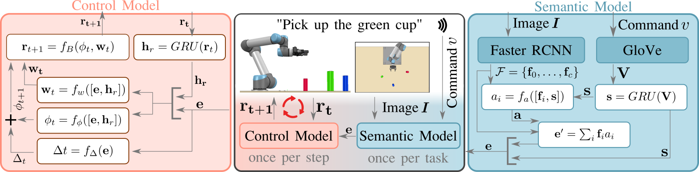
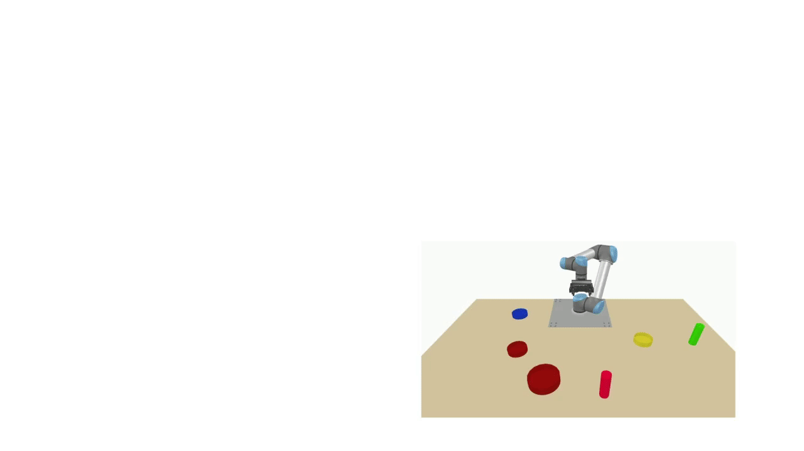

# Language-Conditioned Imitation Learning for Robot Manipulation Tasks
This repository is the official implementation of [Language-Conditioned Imitation Learning for Robot Manipulation Tasks](https://arxiv.org/abs/2010.12083), which has been accepted to NeurIPS 2020 as spotlight presentation.

<div style="text-align:center"></div>

When using this code and/or model, we would apprechiate the following citation:
```
@misc{stepputtis2020languageconditioned,
      title={Language-Conditioned Imitation Learning for Robot Manipulation Tasks}, 
      booktitle = {Advances in Neural Information Processing Systems},
      author={Simon Stepputtis and Joseph Campbell and Mariano Phielipp and Stefan Lee and Chitta Baral and Heni Ben Amor},
      year={2020},
      eprint={2010.12083},
      archivePrefix={arXiv},
      primaryClass={cs.RO},
}
```

## Inddex
1. [Environment Setup](#environment-setup)
      - [Local Setup](#local-setup)
      - [Docker](#docker)
2. [Quick Start](#quick-start)
      - [Details: Data Collection](doc/data_collection.md)
      - [Details: Training and Evaluation](doc/evaluation.md)
3. [Results](#results)
      - [Additional Results](doc/detailed_results.md)
      - [Various Demonstrations](doc/demonstrations.md)

## Environment Setup
### Local Setup
Our code is tested on __Ubuntu 18.04__ with __Python 3.6__. At this time, running our code on MacOS or Windows is not supported. To install Python requirements:
```setup
pip install -r requirements.txt
```
Further requirements for _Evaluation_:
- [CoppeliaSim](https://www.coppeliarobotics.com/downloads): Downloading and installing the player version will be sufficient, as long as you do not want to change the simulation environment itself. Our code was tested with version 4.0 and 4.1
- [ROS 2 Eloquent](https://index.ros.org/doc/ros2/Installation/Eloquent/): ROS is used for communication between the simulator and the neural network. Before running our code, please make sure to compile and source the workspace _ros2_ in this repository in order for our code to find the required packages
- [PyRep](https://github.com/stepjam/PyRep): Please follow the installation instructions at the respective repository.


Further requirements for _Data Collection_:
- [Orocos KDL](https://github.com/orocos/orocos_kinematics_dynamics): The python-wrapper has to match the solver version installed on your system. We strongly suggest to install both components from the git repository. For Python3, the following [GitHub-Issue](https://github.com/orocos/orocos_kinematics_dynamics/issues/115#issuecomment-363828002) provides guidance for the installation process.

To run the model, you need to download the __dataset__, __pre-trained model__, and other required files. The required files can be downloaded from [here](https://drive.google.com/uc?id=1hxHmeBEWxhaiIFYW4BKpatz_AFnmqNxt). The downloaded file contains a pre-trained model, the processed training dataset (and other supporting files), and the test-data used for evaluation.
The downloaded file should be placed next to the root folder of this repository. The folder _LanguagePolicies_ and the extracted _GDrive_ should reside in the same directory. 

### Docker
If you rather look at this code in a Docker container, we provided a Dockerfile with this repository. To build the container, run the following 
```
docker build -t languagepolicies .
```
After the container is successfully built, start it with the following command (please note that the container takes some time to start up fully) 
```
docker run -p 6081:80 -e RESOLUTION=1280x720 --rm languagepolicies
```
After seeing some terminal output, direct your browser to [localhost:6081](http://localhost:6081). This repository is fully set up in _~/Code_, and you can follow the instructions below to train and/or evaluate the model. In the container, you can find a terminal in the start menu under _System Tools -> LXTerminal_.

Please note that data collection and processing is not supported in the docker container.

## Quick Start
A detailed description of the training and evaluation process can be found on our [Details: Training and Evaluation](doc/evaluation.md) page. If you are interested in collecting data, please refer to our [Details: Data Collection](doc/data_collection.md) page.

### Training
To train the model with default parameters, run the following command in this repository's root directory. 
```training
python main.py
```
The trained model will be located in _Data/Model_, and TensorBoard logs will be in _Data/TBoardLog_. Overall, training will take around 35 hours, depending on your hardware. A GPU is not required, and our model has been trained on a node with two _Intel Xeon CPU E5-2699A v4 @ 2.40GHz_. Please note that the usage of a GPU is not beneficial to our model due to the use of a custom RNN loop.


### Evaluation
Our model can be live-evaluated in CoppeliaSim. To run the evaluation, ROS2 is required. Please start by building the _ros2_ workspace and source it. First, the pre-trained model will be loaded from the _GDrive_ directory and provided as a service with 
```
python service.py
```
After the service has been started, the model can be evaluated in the simulator with 
```
python val_model_vrep.py
```
This will create a file _val\_result.json_ after ten evaluation runs (Results in our paper are from 100 runs. This value can be changed). Results can be printed in the terminal by running. 
```
python viz_val_vrep.py
```

## Results
We summarize the results of testing our model on a set of 100 unseen, new environments. Our model's overall task success describes the percentage of cases in which the cup was first lifted, and then successfully poured into the correct bowl. This sequence of steps was successfully executed in 84% of the new environments. Picking alone achieves a 98% success rate while pouring results in 85%. The _Detection_ rate indicates the success rate of the semantic model, attempting to identify the correct objects. _Content-In-Bowl_ outlines the percentage of material that was delivered to the correct bowl during the pouring action. Finally, we report the mean-absolute-error of the robot's joint configuration. These results indicate that the model appropriately generalizes the trained behavior to changes in object position, verbal command, or perceptual input. In additon, we also compared the models performance to a simple RNN approach and a recent state-of-the-art baseline ("_Pay attention!-robustifying a deep visuomotor policy through task-focused visual attention_" Abolghasemi et. al.):

| Model              | Picking         | Pouring        | Sequential         | Detection | Content-In-Bowl | MAE (Joints, Radiant)  |
| ------------------ | :-------------: | :------------: | :----------------: | :-------: | :-------------: | :--------: |
| __Simple RNN__     |     58%         |      0%        | 0%                 | 52%       | 7%              | 0.30&#176; |
| __PayAttention!__  |     23%         |      8%        | 0%                 | 66%       | 41%             | 0.13&#176; |
| __Ours__           |     98%         |      85%       | 84%                | 94%       | 94%             | 0.05&#176; |

Further results can be found in our [Additional Results](doc/detailed_results.md) page.

An execution of our model in a specific environment is shown below. First, the languaage command _Rais the green cup_ and an image of the current environment is given to the model. This allows the robot to identify the target object in the current environment, as well as and desired action. After the cup has been picked up, a second comand _Fill all of it into the small red bowl_ is issued and processed in the same environment. In addition to identify the target bowl and action (the _what_ and _where_), the robot also identifies a quantity modifier, used to describe _how_ the robot should execute the described task. In this case, all of the cup's content is filled into the target bowl. 

<div style="float:left">
      
      
</div>

More examples can be found in the [Additional Examples](doc/demonstrations.md)

## Contributing 
If you would like to contribute or have any suggestions, feel free to open an issue on this GitHub repository or contact the first author of this work!

All contributions welcome! All content in this repository is licensed under the MIT license.
