# Further Demonstrations

    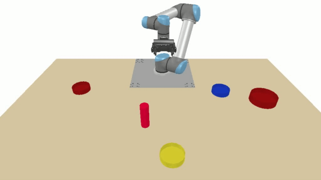  
    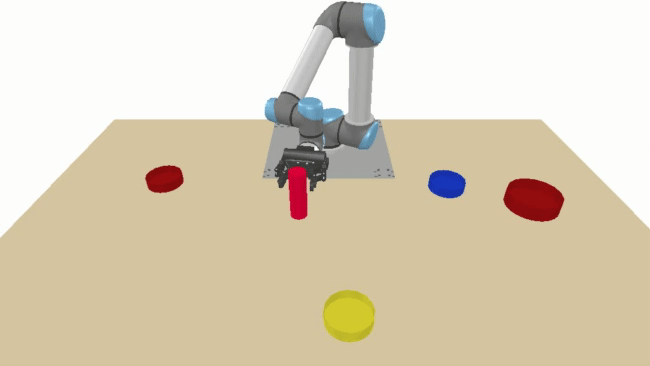  

<table style="width: 100%; table-layout: fixed;"> <tr> <td>Lift the cup up</td><td>Pour some into the tiny cardinal bowl</td></tr></table>

    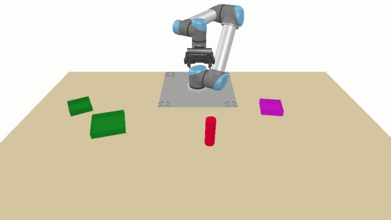  
    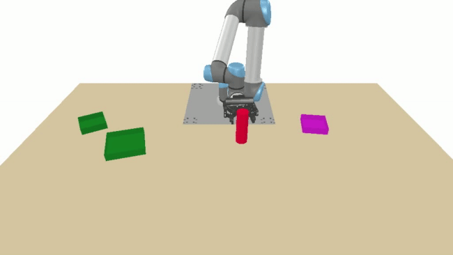  

<table style="width: 100%; table-layout: fixed;"> <tr> <td>Lift the container up</td><td>Fill all of it into the smallest green dish</td></tr></table>

    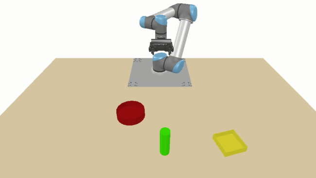  
    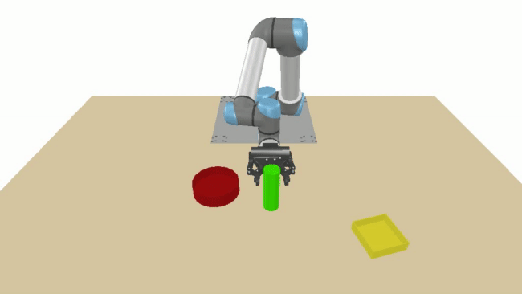  

<table style="width: 100%; table-layout: fixed;"> <tr> <td>Raise the container</td><td>Spill everything into the curved dish</td></tr></table>

    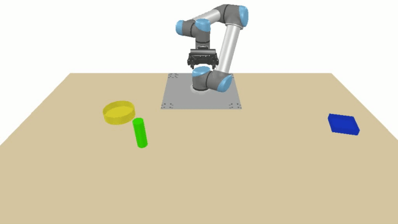  
    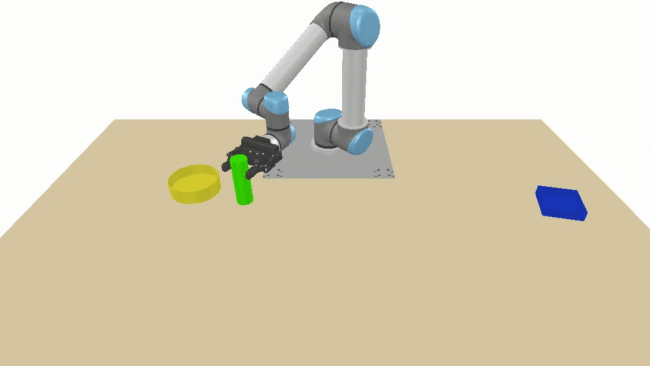  

<table style="width: 100%; table-layout: fixed;"> <tr> <td>Grab the container</td><td>Fill a small amount into the round pot</td></tr></table>

    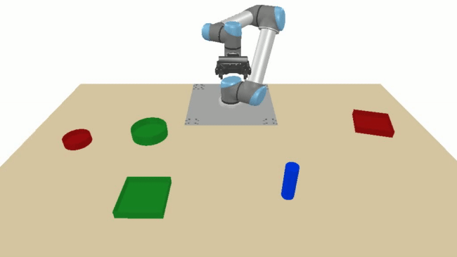  
    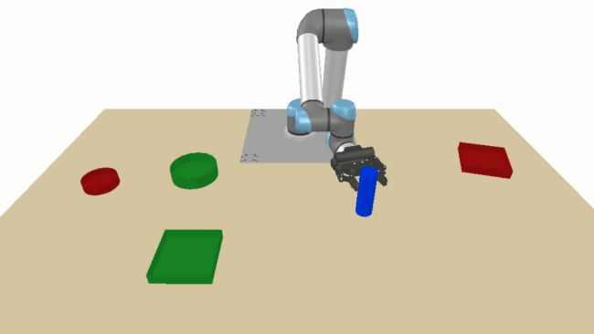  

<table style="width: 100%; table-layout: fixed;"> <tr> <td>Lift the container</td><td>Fill a little into the round green pot</td></tr></table>

    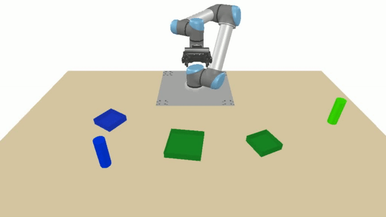  
    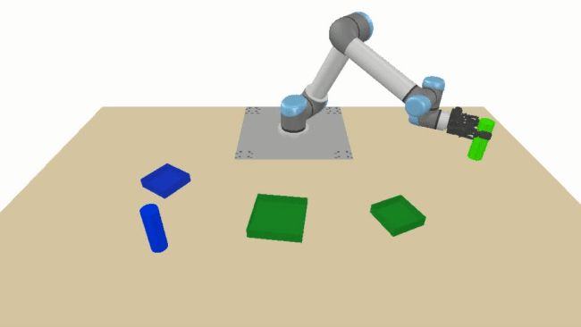  

<table style="width: 100%; table-layout: fixed;"> <tr> <td>Elevate the green container</td><td>Pour everything into the tiny jade basin</td></tr></table>

    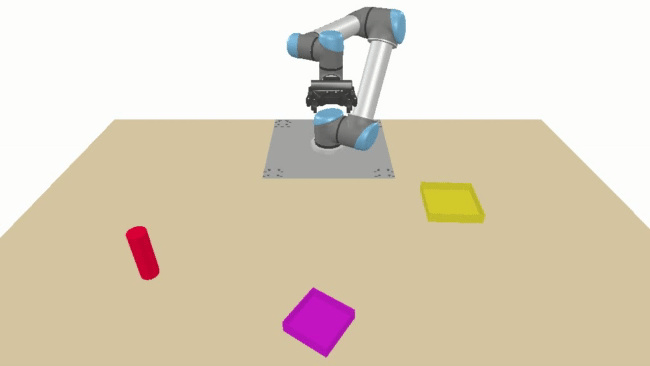  
    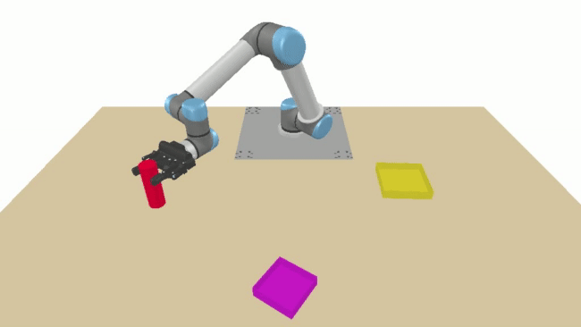  

<table style="width: 100%; table-layout: fixed;"> <tr> <td>Take the container up</td><td>Fill a lot into the small basin</td></tr></table>

    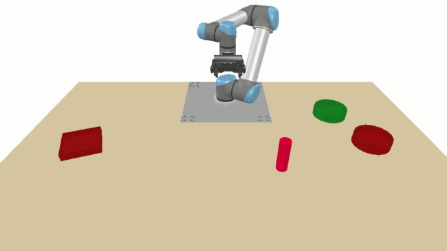  
    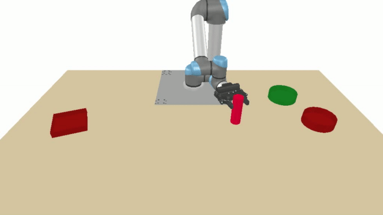 

 
<table style="width: 100%; table-layout: fixed;"> <tr> <td>Gather the stein</td><td>Pour everything into the round crimson dish</td></tr></table>

    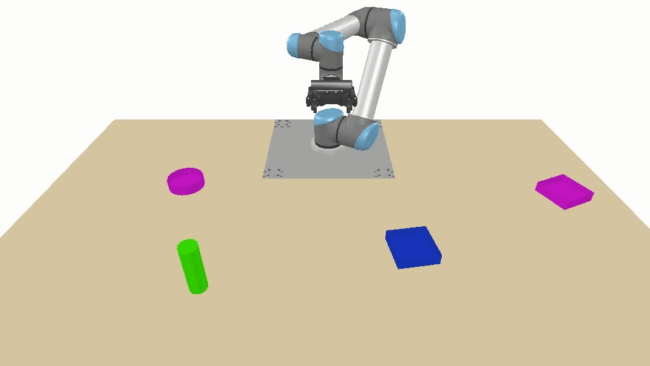  
    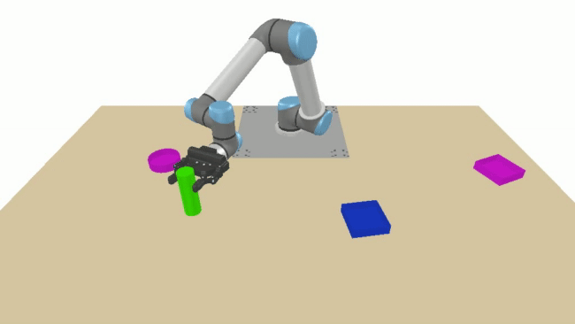  

<table style="width: 100%; table-layout: fixed;"> <tr> <td>Pick the container up</td><td>Fill a small amount into the rectangular rose basin</td></tr></table>

    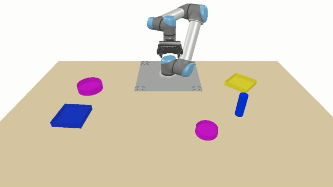  
    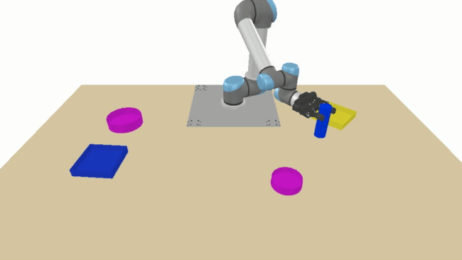 

 
<table style="width: 100%; table-layout: fixed;"> <tr> <td>Take the container up</td><td>Spill a little into the big rose dish</td></tr></table>
