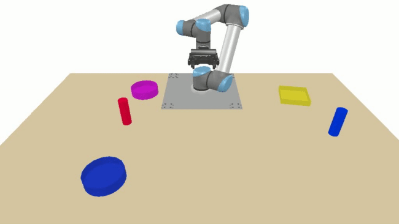
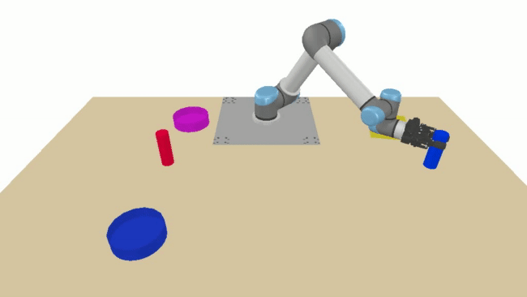
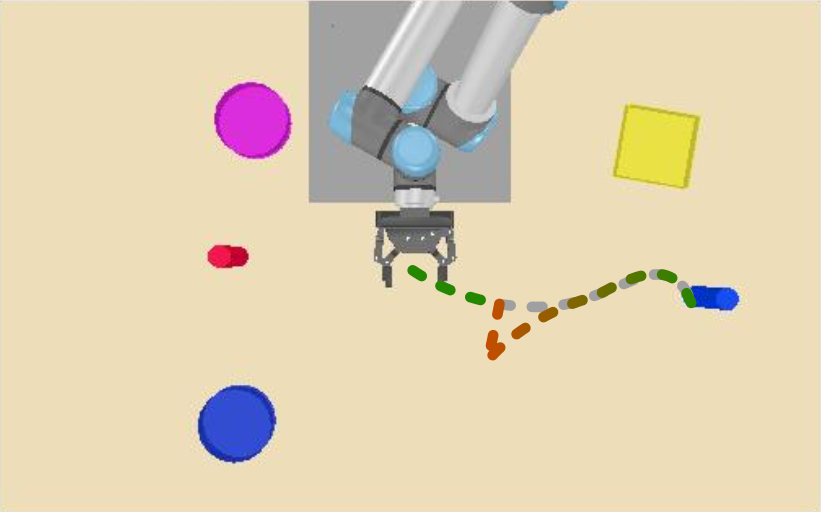
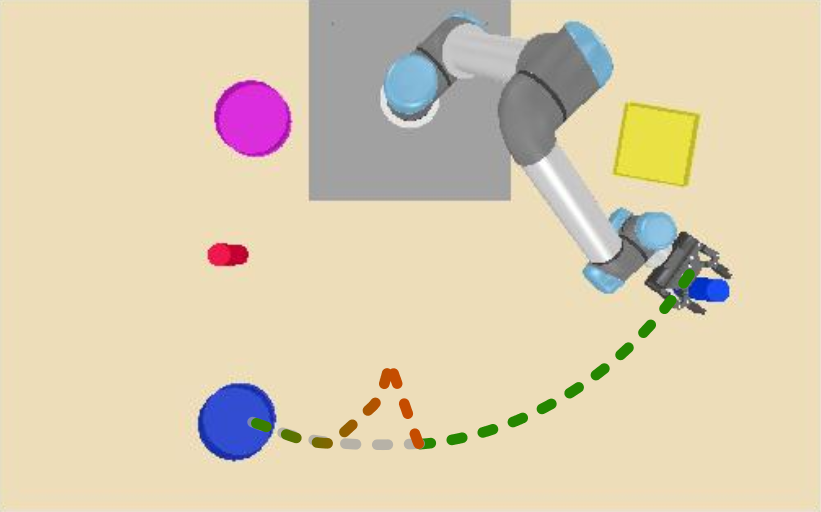
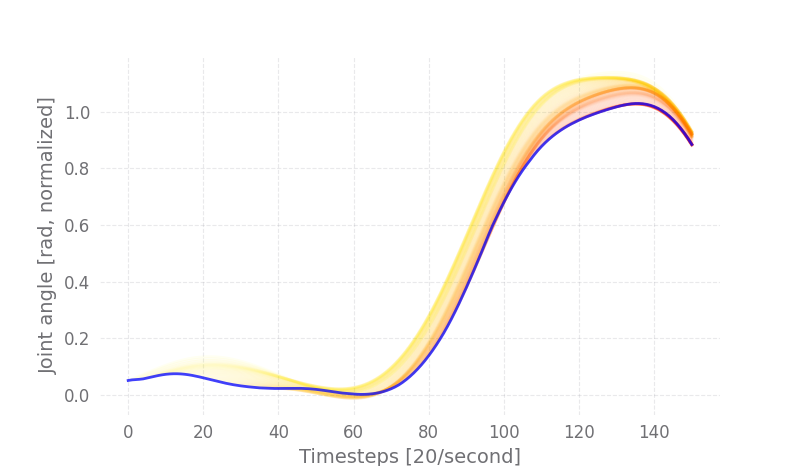
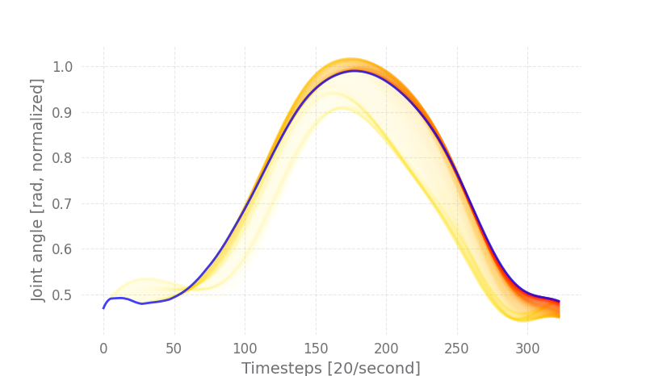
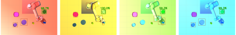

# Detailed Results
This page contains a high-level overview of the main results presented in this work. Further details can be found in the [paper](https://arxiv.org/abs/2010.12083).

## Physical Perturbation
The control model works in a closed-loop fashion, taking potential discrepancies (and perturbations) between the desired robot motion and the actual motion of the robot into consideration.
In the physical perturbation experiment, we push the robot out of its path by applying a force at around 30% of the distance-to-goal. 
The following two videos show the model's ability to recover from perturbations:

      
      
      
      

The resulting motion trajectories of the perturbations induced in the videos can be seen in the respective images below the video. 
The gray trajectory indicates the original robot movement without perturbation, whereas the green and red trajectory indicate the actual motion that was executed by the robot after a force has been applied to the robot. 
It can be seen from the figures that the model quickly recovers from the perturbation and returns to the correct trajectory in order to successfully complete the respective tasks. 

    
    

Our model's closed-loop nature continuously adapts to changes in the robot state and re-generates new trajectories by re-generating the motor primitive, allowing for various adaptions. The above figure shows the gripper's joint angle in a picking task, changing from being open (value at 0) to being closed (value at 1). The execution of the grasp (blue trajectory) was delayed in time, as shown by the early motion predictions plotted in yellow. Motion predictions that have been made later after more observations of the current robot state were available are represented in red, similarly, for the right figure, which shows the pouring motion of the robot's wrist joint, where the overall pouring duration has been increased by starting the pouring earlier and ending it later than initially anticipated while slightly reducing the pouring angle. Both figures indicate our model's ability to adapt to potential motion changes over time.

## Verbal Generalization
To generate training and test data, we have asked five human experts to provide verbal task description templates. 
In turn, these templates are used as sentence generators from which multiple sentences can be extracted via synonym replacement. 
In order to generate a task description, we identify the minimal set of visual features required to identify the target object while breaking ties randomly uniquely. 
Synonyms for objects, visual feature descriptors, and verbs are chosen at random. They are applied to a randomly chosen template sentence in order to generate a possible task description. The synonyms used during training are shown in the following table:

| Baseword | Synonyms used during training                                        |
| -------- | -------------------------------------------------------------------- |
| round    | round, curved                                                        |
| square   | square, rectangular                                                  |
| small    | small, tiny, smallest, petite, meager                                |
| large    | large, largest, big, biggest, giant, grand                           |
| red      | red, ruby, cardinal,   crimson, maroon, carmine                      |
| green    | green, olive, jade                                                   |
| blue     | blue, azure, cobalt, indigo                                          |
| yellow   | yellow, amber, bisque, blonde, gold, golden                          |
| pink     | pink, salmon, rose                                                   |
| cup      | cup, container, grail, stein                                         |
| pick     | pick_up, gather, take_up, grasp, elevate, lift, raise, lift_up, grab |
| pour     | pour, spill, fill                                                    |
| little   | a little, some, a small amount                                       |
| much     | everything, all of it, a lot                                         |
| bowl     | bowl, basin, dish, pot                                               |

Subsequently, we evaluate our model's performance when interacting with a new set of four human users, from which we collect 160 new sentences that are directly used in our model.
A selection reflecting the variability of the sentences that have been provided by new users can be seen in the following table, highlighting new words and sentence structures that have not been part of the training set. 

| New words and sentences for the _picking_ task | New words and sentences for the _pouring_ task    |
| ---------------------------------------------- | ------------------------------------------------- |
| Pick up the **dark blue** cup                  | **Lightly** pour into the blue bowl               |
| Grab the red cup                               | **Completely empty** it into the small green dish |
| **Hold** the green veil                        | **Fully pour** it into the red bowl               | 
| **Pick up** the blue cup                       | Pour **half of it** into the square green bowl    | 
| **Lift** the cup                               | **Put all its content** into the square bowl      |
| **Take** the **dark blue** cup                 | **Dump** everything it into the large yellow pot  |
| **Select** the red cup                         | Pour a **small amount** into the yellow bowl      |
| Pick the green cup up                          | Fill **it all** into the small red bowl           | 

When tested with new language commands, our model successfully performs the entire sequence in 64% of the cases. 
The model nearly doubles the trajectory error but maintains a reasonable success. 
It is also observable that most of the failed task sequences primarily result from a deterioration in pouring task performance (a reduction from 85% to 69%). Picking remains at 93%.

    
    

The above figure shows the importance of a task instruction in order to disambiguate which object to use in the environment. 
In this setting, the environment is exactly the same, whereas the task descriptions instruct the robot to dispense different quantities into different bowls. 
This result underlines our model's ability to generate language-conditioned control policies. 

## Illumination changes

The above figure shows examples of the same task executed in different illuminated scenarios. This experiment highlights this approach's ability to cope with perceptual disturbances, even though it was not trained with perturbed images. Evaluating the model under these conditions yields a task completion rate of 62%, and the primary source of accuracy loss is the detection network misclassifying or failing to detect the target object. However, it is essential to note that the object detection module (FRCNN) is not part of this work's contribution or focus. 

## General Results

The below table summarizes the results of testing our model on a set of 100 novel environments. Our model's overall task success describes the percentage of cases in which the cup was first lifted and then successfully poured into the correct bowl. This sequence of steps was successfully executed in 84\% of the new environments. Picking alone achieved a 98\% success rate while pouring resulted in 85\%. While the task success rate is the most critical metric in such a dynamic control scenario, the table also shows the object detection rate (Dtc), the percentage of dispersed cup content inside the designated bowl (PIn), the percentage of correctly dispersed quantities (QDif), underlining our model's ability to adjust motions based on semantic cues, the mean-average-error of the robot's configuration in radians (MAE), as well as the distance between the robot tool center point and the center of the described target (Dst). The error statistics describe the success rate of the pouring tasks depending on which combination of visual features was used to describe the target uniquely. For example, when no features were used (column "None"), only one bowl was available in the scene, and no visual features were necessary.

Further combinations of color (C), size (S), and shape (F) are outlined in the remaining columns. We noticed that the performance decreased to about 70\% when the target bowl needed to be described in terms of shape and size, even though the individual features had substantially higher success rates of 100\% and 85\%, respectively. It is also notable that our model completed the pouring action in all scenarios in which either the shape or a combination of shape and color were used. The remaining feature combinations reflected the general success rate of 85\% for the pouring action.

| # | Evaluation        | Pick | Pour | Seq  | Dtc  | PIn  | QDif | MAE  | Dst  | None | C    | S    | F    | C+S  | C+F  | S+F  | C+S+F |
| - | ----              | ---- | ---- | ---- | ---- | ---- | ---- | ---- | ---- | ---- | ---- | ---- | ---- | ---- | ---- | ---- | ----- |
| 1 | Loss: T           | 0.57 | 0.53 | 0.28 | 0.83 | 0.61 | 0.79 | 0.15 | 9.33 | 0.83 | 0.36 | 0.69 | 1.00 | 0.31 | 0.00 | 0.90 | 0.56  |  
| 2 | Loss: P, Dt, W, T | 0.00 | 0.44 | 0.00 | 0.67 | 0.57 | 0.74 | 0.17 | 20.9 | 1.00 | 0.33 | 0.62 | 0.50 | 0.27 | 0.00 | 0.80 | 0.30  |
| 3 | Loss: A, T        | 0.62 | 0.84 | 0.51 | 0.97 | 0.89 | 0.94 | 0.12 | 4.16 | 0.83 | 0.89 | 0.85 | 1.00 | 0.82 | 0.67 | 0.80 | 0.67  |
| 4 | DS 2,500          | 0.69 | 0.15 | 0.10 | 0.67 | 0.36 | 0.55 | 0.18 | 13.9 | 0.33 | 0.06 | 0.23 | 0.50 | 0.00 | 0.00 | 0.50 | 0.00  |
| 5 | DS 5,000          | 0.58 | 0.17 | 0.10 | 0.69 | 0.39 | 0.65 | 0.20 | 11.6 | 0.67 | 0.09 | 0.15 | 0.67 | 0.08 | 0.00 | 0.30 | 0.00  |
| 6 | DS 10,000         | 0.54 | 0.55 | 0.29 | 0.86 | 0.65 | 0.67 | 0.11 | 7.17 | 0.83 | 0.42 | 0.69 | 1.00 | 0.35 | 0.33 | 0.90 | 0.44  |
| 7 | DS 20,000         | 0.80 | 0.72 | 0.59 | 0.90 | 0.84 | 0.91 | 0.13 | 8.81 | 0.83 | 0.71 | 0.85 | 1.00 | 0.71 | 0.33 | 0.70 | 0.56  |
| 8 | DS 30,000         | 0.94 | 0.86 | 0.80 | 0.94 | 0.95 | 0.94 | 0.05 | 4.12 | 0.67 | 0.86 | 0.92 | 1.00 | 0.88 | 0.33 | 0.90 | 1.00  |
| 9 |__Our model__      | 0.98 | 0.85 | 0.84 | 0.94 | 0.94 | 0.94 | 0.05 | 4.85 | 0.83 | 0.83 | 0.85 | 1.00 | 0.88 | 1.00 | 0.70 | 0.89  |

Line 1-3 shows the influence of using our four auxiliary losses: phase prediction (P), phase progression (Dt), weight constraints (W), and attention (A) in addition to the main trajectory generation (T) loss after the model generated the final trajectory. An interesting observation is that adding the attention loss significantly increased the pouring task's performance but does not yield peak performance for the picking task. The latter is achieved by adding additional constraints to the motor primitive generation. We argue that the higher precision required for the picking task is the reason for this behavior. 

Line 4-8 shows our model's performance when trained on different dataset sizes. A significant increase can be seen when increasing the size in steps from 2,500 to 30,000. However, our final model is trained on 40,000 samples with only a ~4% performance increase, indicating that a further increase in dataset size would not yield significantly better results. 

The performance of our final model can be seen in line 9.